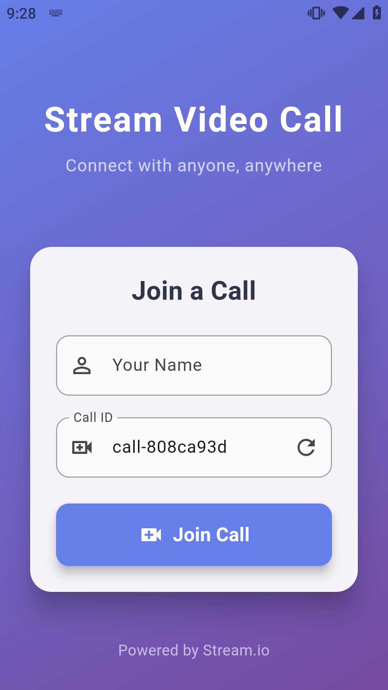
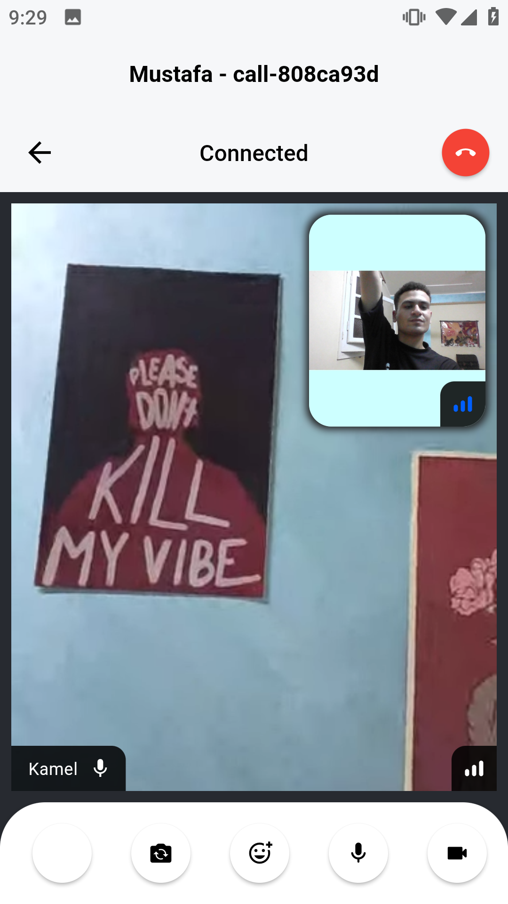

# Stream Video Call App 📹

A modern Flutter video calling application built with Stream.io's Video SDK, featuring real-time video communication with a beautiful, animated user interface.

<div align="center">
  
  
</div>

## ✨ Features

- **Real-time Video Calling**: High-quality video calls powered by Stream.io
- **Beautiful UI**: Modern gradient design with smooth animations
- **Easy Call Management**: Simple join/leave call functionality
- **Custom Controls**: Flip camera, toggle microphone/camera, reactions, and more
- **Error Handling**: Comprehensive error handling with custom error screens
- **Loading States**: Animated loading screens for better user experience
- **Cross-platform**: Runs on Android, iOS, Web, Windows, macOS, and Linux

## 🏗️ Architecture

The app follows a clean architecture pattern with the following structure:

```
lib/
├── core/
│   ├── services/
│   │   └── stream_video_service.dart    # Stream Video SDK management
│   ├── app_theme.dart                   # App theming and styling
│   ├── ....                   
│   └── token_generator.dart             # JWT token generation for development
├── views/
│   ├── widgets/
│   │   ├── custom_error_view.dart       # Custom error screen
│   │   └── custom_loading_view.dart     # Animated loading screen
│   ├── home_view.dart                   # Main screen for joining calls
│   └── video_call_view.dart             # Video call interface
└── main.dart                            # App entry point
```

## 🚀 Getting Started

### Prerequisites

- Flutter SDK (3.8.1 or higher)
- Dart SDK
- Stream.io account and API credentials

### Installation

1. **Clone the repository**
   ```bash
   git clone <repository-url>
   cd task_guitara_group
   ```

2. **Install dependencies**
   ```bash
   flutter pub get
   ```

3. **Configure Stream.io credentials**
   
   Update the credentials in `lib/core/constants.dart`:
   ```dart
   const apiKey = 'your_stream_api_key';
   const appId = 'your_app_id';
   const apiSecret = 'your_api_secret';
   ```

4. **Run the app**
   ```bash
   flutter run
   ```

## 📱 How to Use

1. **Launch the app** - You'll see the beautiful home screen with gradient background
2. **Enter your name** - Type your display name in the "Your Name" field
3. **Set Call ID** - Use the generated call ID or create your own
4. **Join Call** - Tap the "Join Call" button to start your video call
5. **Call Controls** - Use the bottom controls to:
   - Toggle microphone on/off
   - Toggle camera on/off
   - Flip between front/back camera
   - Add reactions
   - Leave the call

## 🛠️ Key Components

### StreamVideoService
Manages the Stream Video SDK lifecycle, including:
- User authentication with JWT tokens
- Call creation and management
- Proper cleanup and reset functionality

### Custom UI Components
- **CustomLoadingView**: Animated loading screen with rotating video call icon
- **CustomErrorView**: User-friendly error display with retry options
- **AppTheme**: Consistent theming with gradient backgrounds and modern styling

### Token Generation
Development-only JWT token generation for Stream.io authentication. 
⚠️ **Note**: In production, tokens should be generated server-side for security.

## 📦 Dependencies

- **stream_video_flutter**: Stream.io's Flutter Video SDK
- **uuid**: Unique identifier generation
- **crypto**: Cryptographic functions for JWT token generation
- **equatable**: Value equality for Dart objects
- **flutter_bloc**: State management (prepared for future use)

## 🎨 Design Features

- **Gradient Backgrounds**: Beautiful purple-to-blue gradients
- **Smooth Animations**: Fade and slide transitions
- **Modern Cards**: Elevated cards with rounded corners
- **Responsive Design**: Works across different screen sizes
- **Custom Loading**: Animated loading indicators with pulsing effects

## 🔧 Development Notes

### Token Security
The app currently uses client-side JWT token generation for development purposes. For production deployment:
1. Implement server-side token generation
2. Use secure API endpoints for authentication
3. Implement token refresh mechanisms

### State Management
The app is prepared for advanced state management with flutter_bloc, though currently uses simple StatefulWidget state management.

### Platform Support
Configured for all Flutter platforms:
- ✅ Android
- ✅ iOS  
- ✅ Web
- ✅ Windows
- ✅ macOS
- ✅ Linux

## 🤝 Contributing

1. Fork the repository
2. Create your feature branch (`git checkout -b feature/amazing-feature`)
3. Commit your changes (`git commit -m 'Add some amazing feature'`)
4. Push to the branch (`git push origin feature/amazing-feature`)
5. Open a Pull Request

## 📄 License

This project is licensed under the MIT License - see the LICENSE file for details.

## 🙏 Acknowledgments

- [Stream.io](https://getstream.io/) for the excellent Video SDK
- [Flutter](https://flutter.dev/) for the amazing cross-platform framework
- The Flutter community for continuous inspiration

---

**Powered by Stream.io** 🚀

For more information about Stream's Video SDK, visit [Stream Video Documentation](https://getstream.io/video/docs/flutter/)
